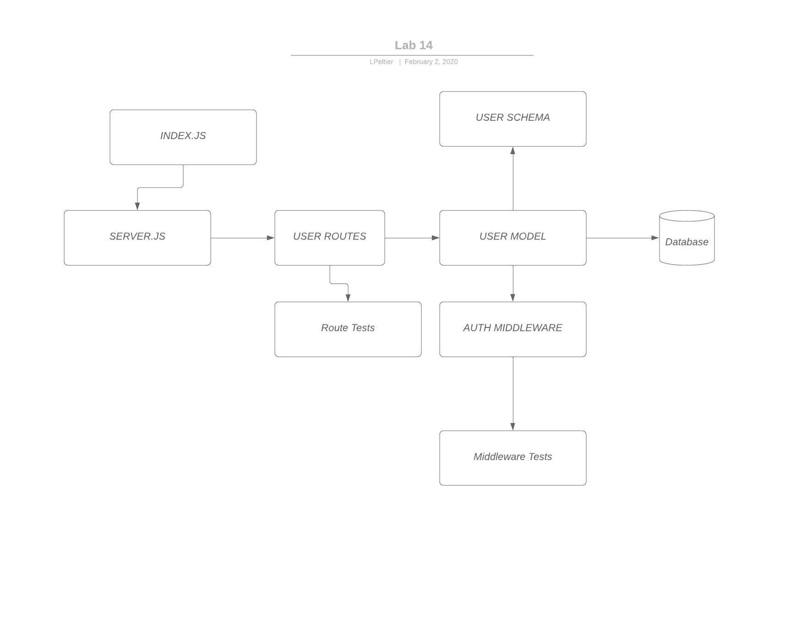

# Apprenti-401-Lab-14

## Access Control

### Author: Lindsay Peltier

### Links and Resources
* [submission PR](https://github.com/LindsayPeltier-401-advanced-javascript/Apprenti-401-Lab-14/pull/1)
* [travis](https://www.travis-ci.com/LindsayPeltier-401-advanced-javascript/Apprenti-401-Lab-14)
* [back-end](https://apprenti-401-lab-14.herokuapp.com/)

#### Documentation
* [api docs](./docs/apprenti-401-lab-14.json)
* [docs](./docs) 

### Setup
#### `.env` requirements (where applicable)
* `PORT` - Port Number
* `MONGODB_URI` - URL to the running mongoDB
* `CLIENT_ID` - Google OAuth ID
* `CLIENT_SECRET` - Google OAuth Secret
* `API_SERVER` - `http://localhost:3000/oauth`
* `TOKEN_SERVER` - `https://oauth2.googleapis.com/token`
* `REMOTE_API` - `https://openidconnect.googleapis.com/v1/userinfo`

#### Server Initialization
* `npm start`
* Endpoint: `/docs`
  * Returns JSdocs
* Endpoint: `/api-docs`
  * Returns swaggerDocs
* Endpoint: `/users`
  * Get all users in the database
* Endpoint: `/signup`
  * Posts new user to database
* Endpoint: `/signin`
  * Posts authorization header against user in database

  
#### Tests
* Unit Tests: `npm test`
* Lint Tests: `npm run lint`

#### UML
